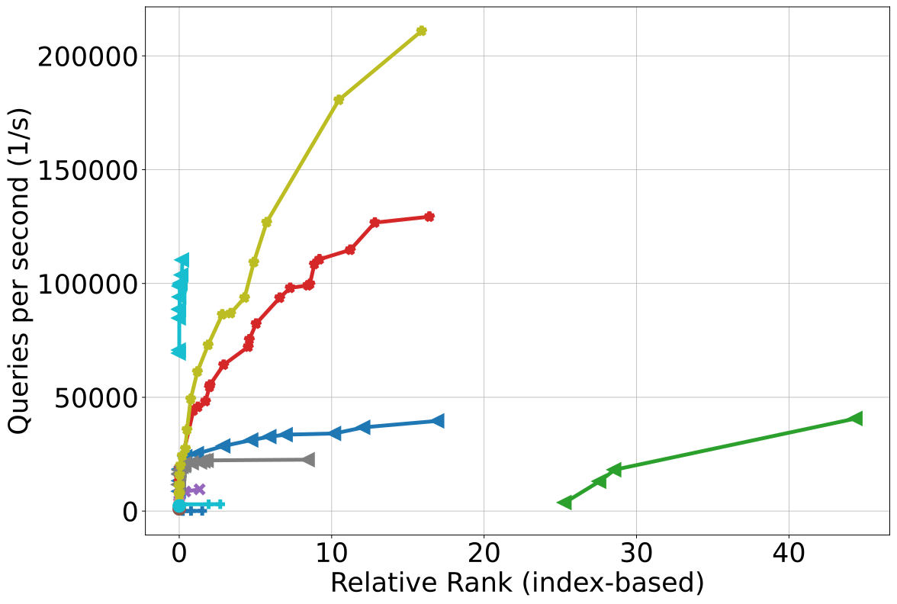
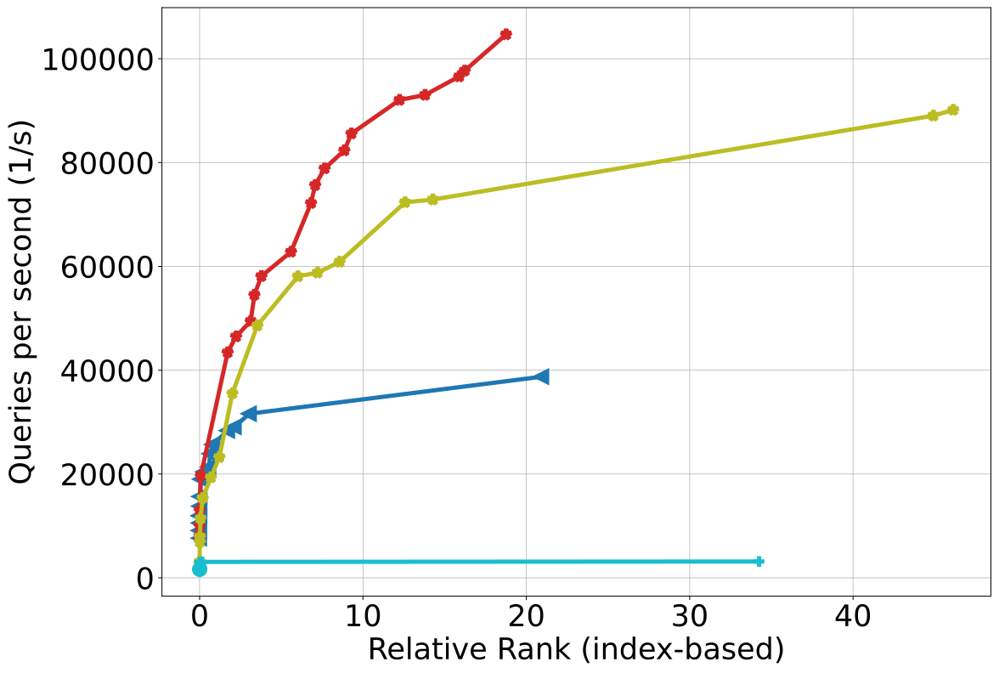
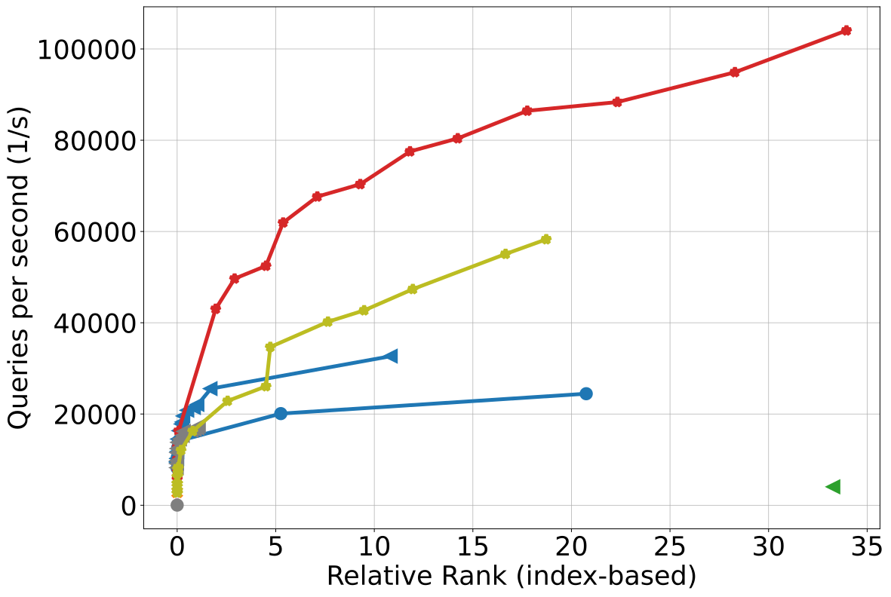
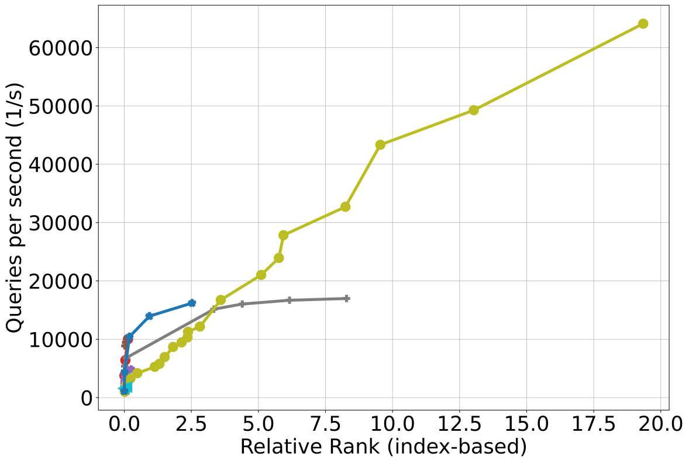
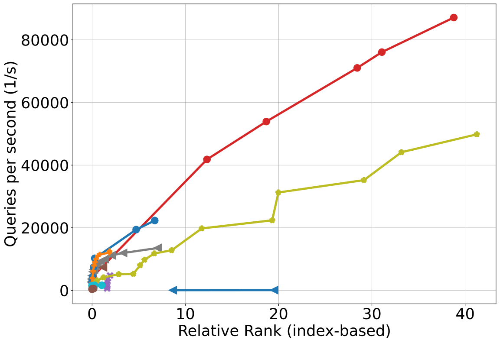
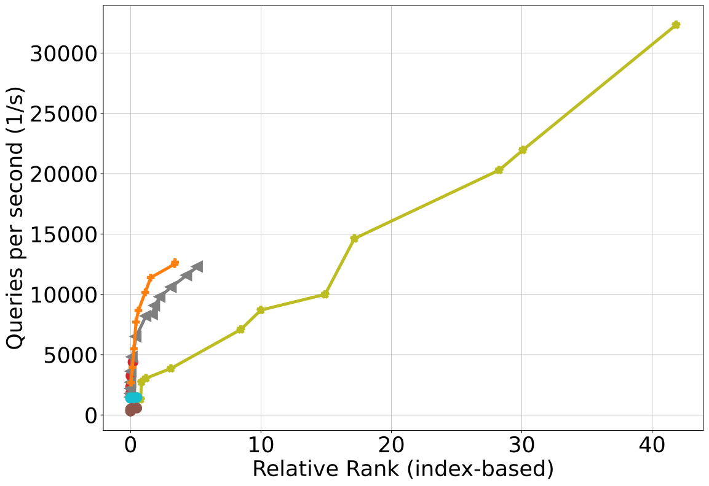
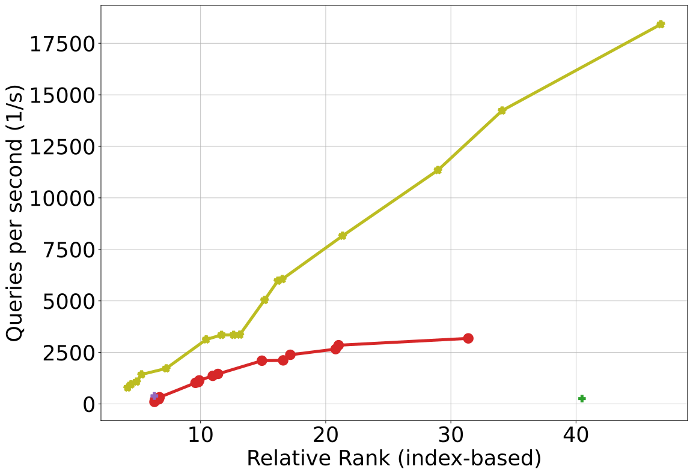
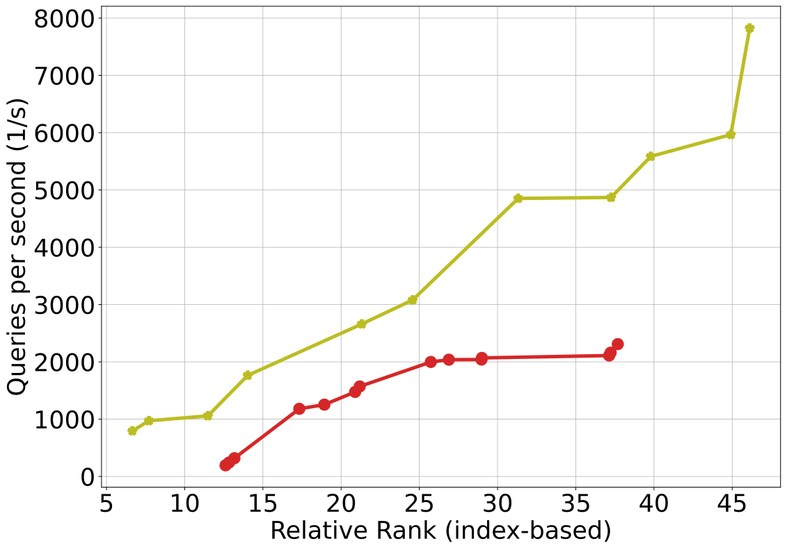
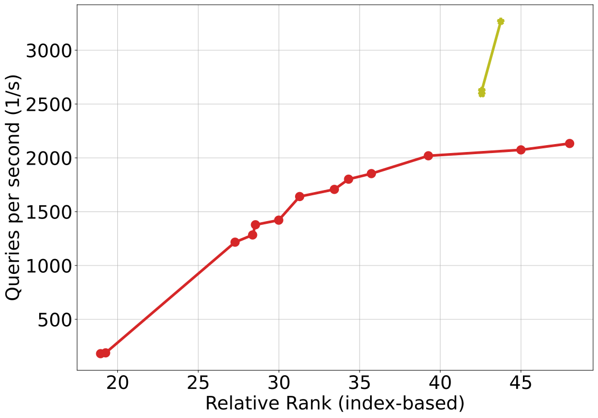

# InfinitySearch

**InfinitySearch** is a Python package for fast nearest neighbor search using an inductive embedding model and a highly optimized VP-Tree backend..

It is especially well-suited for **large datasets** or applications involving **custom dissimilarity measures**, where traditional search methods degrade in performance.
Its main strength is **speed**, both in terms of query throughput and model adaptation.

It supports custom metrics (including Python lambdas), multi-metric search (original vs. embedded distances), and includes automatic configuration via Optuna.

Infinity Search: Approximate Vector Search with Projections on q-Metric Spaces introduces a novel projection method using Fermat distances in q-metric spaces. This allows embedding into structured manifolds while preserving key nearest neighbor relationships, offering efficiency and precision in high-dimensional search problems.

---

## 🚀 Installation

Install with pip:

```bash
pip install .
```

---

## 🧪 Quick Start

```python
from infinitysearch.test import main
main()
```

This runs a quick evaluation using the Fashion-MNIST dataset (grayscale images of clothing, 28×28). It:
1. Loads and flattens the Fashion-MNIST dataset to 784-dimensional vectors.
2. Initializes an `InfinitySearch` instance with a default q-metric.
3. Trains the embedding model and builds a VP-tree index using either cached or optimized configuration.
4. Prepares a batch of queries from the hold-out set.
5. Runs the batch nearest neighbor search.
6. Prints the query throughput (queries per second) and the mean relative rank error.
---

## 🧠 Class: `InfinitySearch`

```python
InfinitySearch(q=2.0, metric_embed="euclidean", metric_real="euclidean")
```

### Parameters:
- **q**: float
  - Exponent used in Fermat distance graph.
- **metric_embed**: str or callable
  - Distance in embedding space. Supported:
    - "euclidean"
    - "cosine"
    - "manhattan"
    - Callable: `f(a: np.ndarray, b: np.ndarray) -> float`
- **metric_real**: str or callable
  - Distance in original/real space. Supported:
    - "euclidean"
    - "cosine"
    - "manhattan"
    - Callable: `f(a: np.ndarray, b: np.ndarray) -> float`

---

## 🔍 Methods

### `fit(X: np.ndarray, config: str | dict = "optuna", verbose: bool = True)`
Trains the embedding model and builds the VP-tree index.

- **X**: ndarray of shape (n_samples, n_features)
- **config**:
  - "optuna" → run Optuna hyperparameter search
  - "last" → use the most recent configuration from cache
  - `str` → named config key stored in cache
  - `dict` → partial user-defined config. Remaining parameters are optimized

#### Config Dictionary Parameters:
- `output_dim`: int — Final embedding dimensionality
- `batch_size`: int — Training batch size (e.g., 128, 256, 512)
- `epochs`: int — Training epochs (e.g., 50–200)
- `lr`: float — Learning rate (log-uniform range)
- `lambda_stress`: float — Weight of the stress loss
- `emb_metric`: str — Embedding space distance

### `prepare_query(X: np.ndarray, n: int = 1, k: int = 1)`
Embeds and stores queries for batch search.

- **X**: 2D array of queries
- **n**: Number of candidates to fetch (≥ k)
- **k**: Final top-k neighbors to return

### `query(v: np.ndarray, n: int = 1, k: int = 1)`
Searches a single query.

- **X**: 1D array of query
- **n**: Number of candidates to fetch (≥ k)
- **k**: Final top-k neighbors to return

- Automatically calls `prepare_query` if needed

### `run_batch_query(X: np.ndarray, n: int = 1, k: int = 1)`
Returns the top-k neighbors for the last batch of queries.

- **X**: 2D array of queries
- **n**: Number of candidates to fetch (≥ k)
- **k**: Final top-k neighbors to return

- Automatically calls `prepare_query` if needed

---

## 📁 Caching & Configurations

- Configurations are cached in `~/.cache/infinitysearch/named_configs.json`
- The most recent run is saved under key `last`
- Named configs are stored and retrieved using their respective keys
- If a named config is not found, Optuna will run and save the result with that name

---

## 🧪 Test Example

This test can be run via:
```python
from infinitysearch.test import main
main()
```

Which is equivalent to:
```python
import numpy as np
from infinitysearch.ann import InfinitySearch

X = np.random.rand(500, 32).astype(np.float32)
import time
import argparse
import numpy as np
from scipy.spatial.distance import cdist
from tensorflow.keras.datasets import fashion_mnist
from infinitysearch.ann import InfinitySearch
from infinitysearch.utils import rel


def main():
    parser = argparse.ArgumentParser()
    parser.add_argument('--q', type=int, default=20, help='q-metric')
    parser.add_argument('--n', type=int, default=10000, help='Total number of points')
    # Default is now 'last'
    parser.add_argument('--config', type=str, default="last", help="'optuna', 'last', or leave empty for manual config")
    args = parser.parse_args()

    (xtr, _), (xte, _) = fashion_mnist.load_data()
    data = np.concatenate((xtr, xte), axis=0).reshape(-1, 28 * 28) / 255.0
    data = data[:args.n]
    split = int(0.8 * len(data))
    train, query = data[:split], data[split:]

    infsearch = InfinitySearch(q=args.q)
    infsearch.fit(train, config=args.config)

    infsearch.prepare_query(query, n=1)
    start = time.time()
    results = infsearch.run_batch_query()
    elapsed = time.time() - start
    qps = len(query) / elapsed
    print(f"Queried {len(query)} points in {elapsed:.8f}s ({qps:.8f} q/s)")

    true_nn = np.argsort(cdist(query, train), axis=1)[:, :1]
    rel_err = rel(true_nn, results)
    print(f"Mean absolute relative error: {rel_err:.4f}")
```

⚠️ Note: It is highly recommended to run InfinitySearch on a machine with a CUDA-compatible GPU, as both training and search efficiency rely on GPU acceleration for large datasets.


---
## 📊 Benchmarks

The following plots show the speed–accuracy tradeoff of InfinitySearch (yellow) compared to other popular vector search algorithms across different datasets.


<p align="center">
  
</p>


| Dataset | Batch = 1 | Batch = 5 | Batch = 10 |
|:--------|:----------|:----------|:-----------|
| **Fashion-MNIST** |  |  |  |
| **GIST**          |   |   |   |
| **Kosarak**       |  |  |  |

---


## 📜 License

This package is distributed for **non-commercial research purposes** only. See `LICENSE` for details.

---

## ✉ Contact

For questions or contributions, please contact: `pariente@seas.upenn.edu`

---

## 📚 Citation

If you use InfinitySearch in your research, please cite:

**Infinity Search: Approximate Vector Search with Projections on q-Metric Spaces**

\[Insert link here\]
